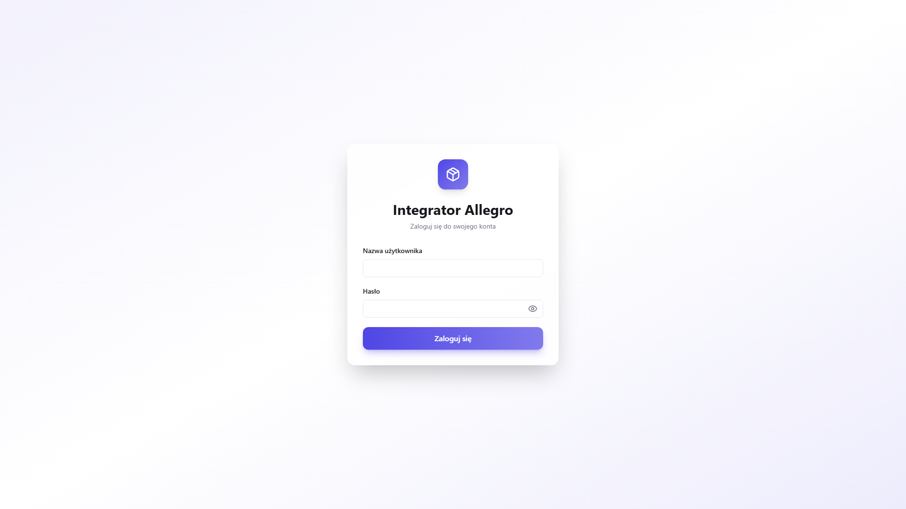
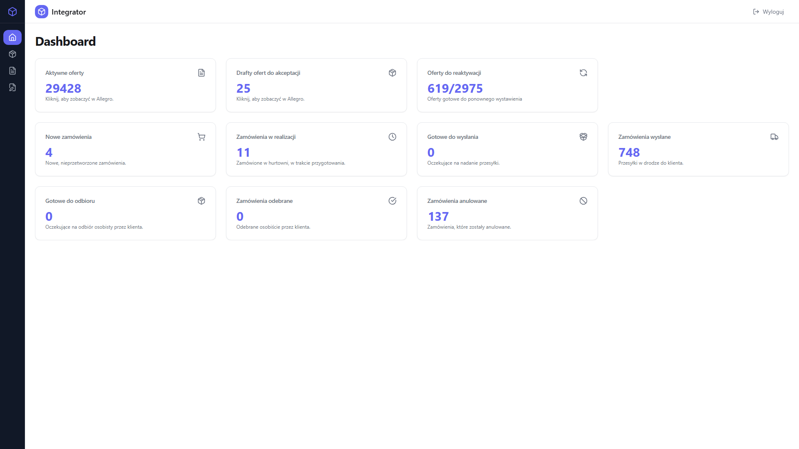
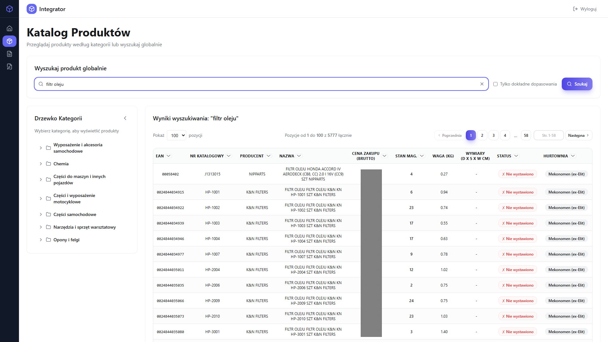
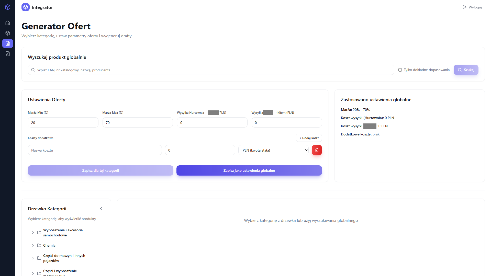
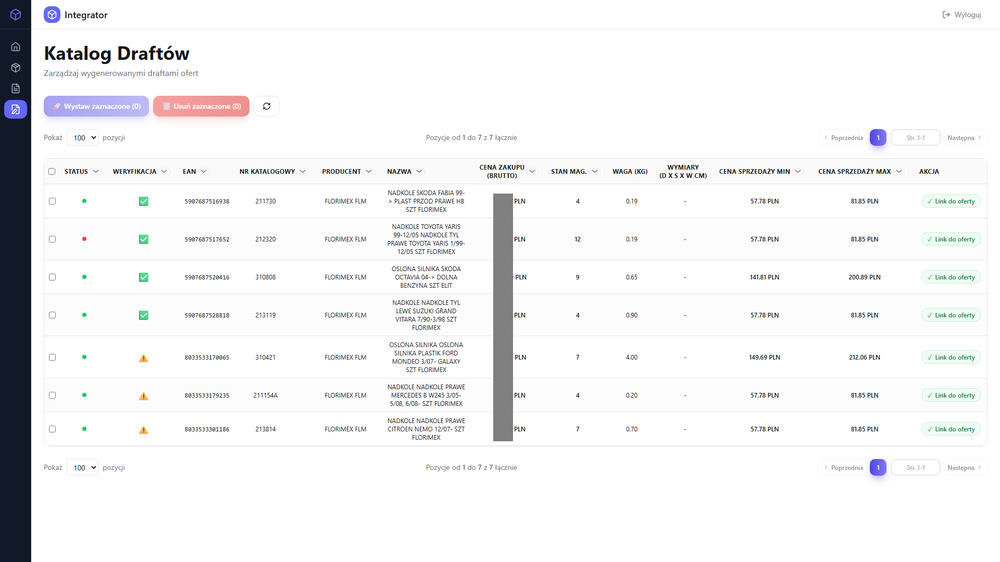
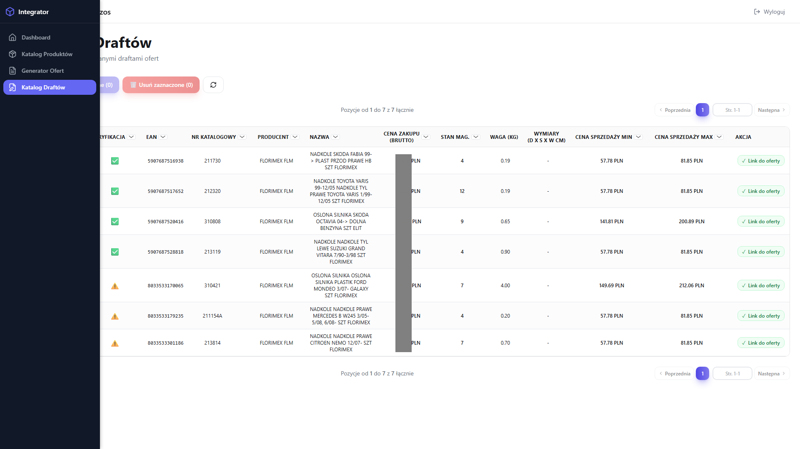
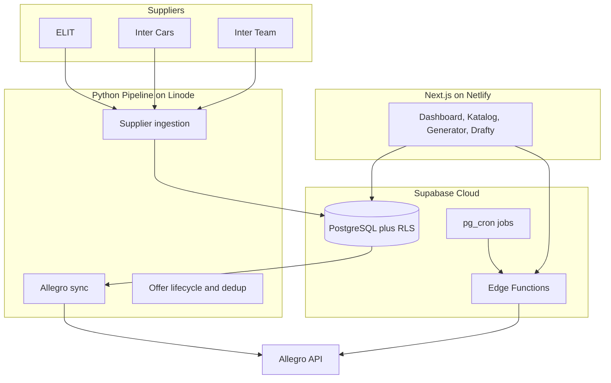

<p align="center">
  
</p>

<h1 align="center">Int3gro.pl</h1>

<h3 align="center">Integrator Allegro</h3>

<p align="center">
  <em>Automotive parts marketplace integration - supplier catalogs, Allegro offers, and order routing in one system.</em>
</p>

<p align="center">
  
  
  
  
  
  
</p>

---

## Table of Contents

- [About](#-about)
- [Screenshots](#-screenshots)
- [Source Code](#-source-code)
- [Tech Stack](#%EF%B8%8F-tech-stack)
- [Features](#-features)
- [Architecture](#-architecture)
- [Statistics](#-statistics)
- [Contact](#-contact)

---

## About

**Int3gro.pl** is a production integration platform I built for syncing automotive parts supplier catalogs to **Allegro**, Poland's largest marketplace. It ingests data from multiple wholesalers (ELIT, Inter Cars, Inter Team, Florimex, Mekonomen), merges and deduplicates products, publishes and manages Allegro offers, and routes customer orders back to the right supplier.

The web panel runs at [int3gro.pl](https://int3gro.pl) on Netlify. A Python pipeline on Linode handles nightly catalog imports, stock sync, and offer lifecycle automation. Supabase powers the database, Edge Functions, RLS, and scheduled jobs.

---

## Screenshots

| Login | Dashboard |
|:---:|:---:|
|  |  |

| Product catalog | Offer generator |
|:---:|:---:|
|  |  |

| Draft offers | Navigation |
|:---:|:---:|
|  |  |

> **Note:** All data shown in the screenshots is fictional and created purely for demonstration purposes. Product names, prices, stock levels, and order details are made up and do not reflect any real supplier or marketplace records.

---

## Source Code

> **The source code is private, but I'm happy to give access to recruiters who'd like to review the implementation.**

**What I can share on request:**

- Full application code (Next.js 16 + React 19 + TypeScript)
- Supabase schema, RLS policies, migrations, and Edge Functions
- Python data pipeline and Allegro integration scripts
- Architecture docs and incident post-mortems

---

## Tech Stack

### Frontend

```
Next.js 16 + React 19      // App Router, SSR auth, Turbopack dev
TypeScript 5               // End-to-end type safety
Tailwind CSS 3.4           // Utility-first UI with Framer Motion
TanStack Table 8           // Server-driven product and order tables
```

### Backend and Data

```
Supabase PostgreSQL        // Unified product view, RLS, pg_cron
19 Edge Functions          // Allegro API, order placement, offer lifecycle
pg_trgm search             // Fast full-text product lookup across catalogs
Netlify                    // Production hosting for int3gro.pl
```

### Pipeline

```
Python 3 on Linode         // Nightly supplier FTP ingest and Allegro sync
23 automation scripts      // Dedup, stale offers, price ranges, stock updates
Allegro REST API           // Offers, orders, categories, fulfillment
Supplier APIs              // ELIT SOAP, Inter Cars OAuth, Inter Team mTLS
```

---

## Features

### Dashboard

- **Live KPI cards** - active offers, drafts, orders, reactivation queue
- **Order tables** - Allegro orders with supplier routing status
- **Pipeline health** - monitored script status from nightly runs
- **Reactivation panel** - bulk re-list ended offers with stock

### Product Catalog

- **Category tree** - Allegro category hierarchy with product counts
- **Global search** - trigram-backed lookup across merged supplier catalogs
- **Paginated tables** - thousands of products with stock and listing status

### Offer Generator

- **Category-based publishing** - select products and configure margins per category
- **Price calculator** - min/max selling price with commission rules
- **Bulk Allegro publish** - Edge Function orchestration for mass listing

### Draft Catalog

- **Draft offer review** - products ready to publish with price preview
- **Allegro price lookup** - real-time price validation before going live

### Automation Pipeline

- **Multi-supplier ingest** - ELIT, Inter Cars, Inter Team catalog imports
- **3-way deduplication** - EAN-based merge into unified product view
- **Offer lifecycle** - auto-end zero-stock offers, reactivate when stock returns
- **Order routing** - place orders at ELIT, Inter Cars, or Inter Team via Edge Functions

### Security

- **Supabase Auth SSR** - cookie-based session with middleware route guard
- **Row Level Security** - admin-only access to catalog and settings tables
- **Cron secret headers** - authenticated scheduled Edge Function invocations

---

## Architecture



---

## Statistics

### Technical Complexity

| Metric | Count |
|---|---|
| **Frontend routes** | 5 |
| **React components** | ~30+ |
| **Supabase Edge Functions** | 19 |
| **SQL migrations** | 46 |
| **Python pipeline scripts** | 23 |
| **Supplier integrations** | 5 |

### Features Overview

| Category | Highlights |
|---|---|
| **Catalog** | Multi-supplier merge, trigram search, category tree |
| **Offers** | Bulk publish, draft review, price calculator, reactivation |
| **Orders** | Allegro fetch, supplier routing, status sync |
| **Pipeline** | Nightly ingest, dedup, stock sync, stale offer cleanup |
| **Security** | RLS, SSR auth, cron secrets, admin guards |

---

## Contact

| Platform | Link |
|---|---|
| **Email** | [w.andrysiak.s3@gmail.com](mailto:w.andrysiak.s3@gmail.com) |
| **GitHub** | [wandrysiak](https://github.com/wandrysiak) |

---

**Int3gro.pl** - connecting automotive wholesale catalogs with Allegro at scale.

<p align="center"><em>Made by Wojciech Andrysiak</em></p>
